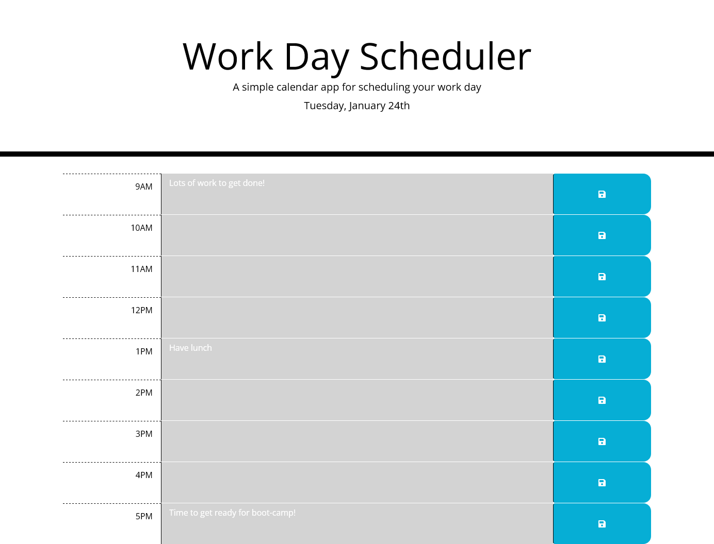

# Work Day Scheduler

## Description

This is a simple calendar application that allows a user to save events for 9:00-17:00 work hours of the day. This app will runs in the browser and feature dynamically updated HTML and CSS powered by Bootstrap and jQuery. It also makes use of the Moment.js library to work with date and time.

## Installation

N/A

## Usage

The user can add a task by selecting the associated textarea then type the required task text and click on the save button associated with that task at a particular time. The user can also edit or clear the text by modifying the task text and clicking the save button again. Empty text will remove the task from the Scheduler. The tasks will persist after the browser refreshes.
The colours shown represent whether that particular hour is before (gray), same (red) or after (green) the current time.

View deployed application:
[Work Day Scheduler](https://warrentyler.github.io/work-day-scheduler/)

An example schedule.

## Credits

N/A.

## License

N/A.
